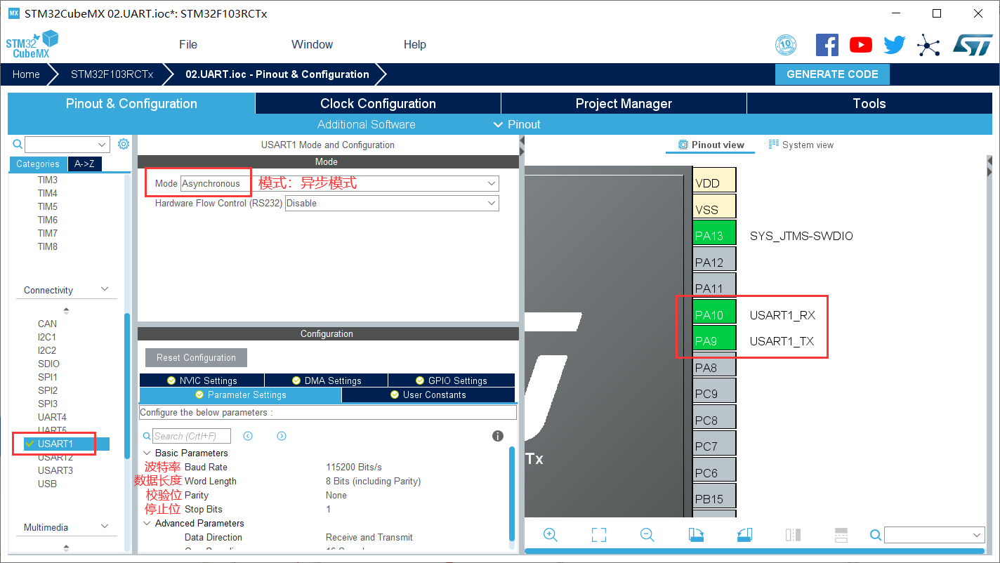
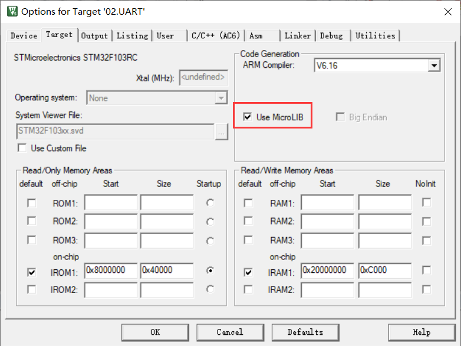
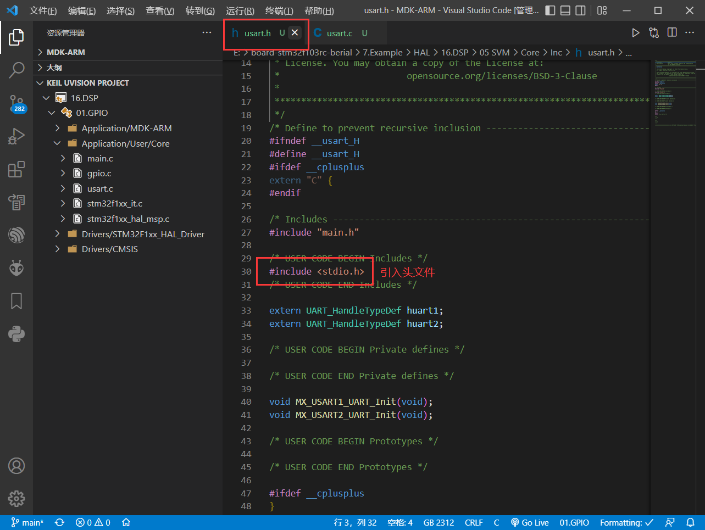
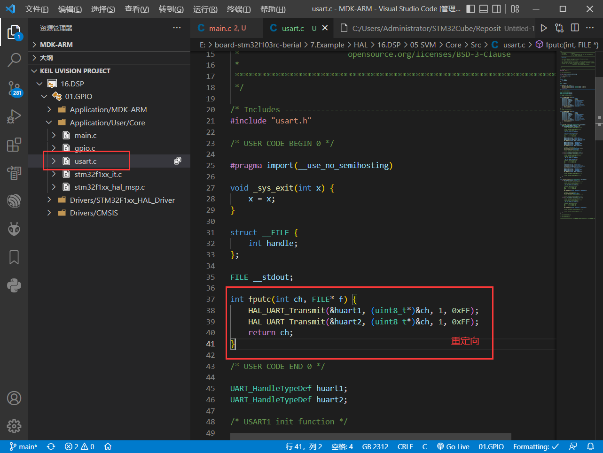

## UART

UART：通用异步收发器 Universal Asynchronous Receiver/Transmitter

USART：通用同步/异步串行接收/发送器 Universal Synchronous/Asynchronous Receiver/Transmitter

### 相关函数

在 `stm32f1xx_hal_uart.h` 中，有以下函数（部分）：

* 发送数据（超时管理机制）

```c
HAL_StatusTypeDef HAL_UART_Transmit(UART_HandleTypeDef *huart, uint8_t *pData, uint16_t Size, uint32_t Timeout);
```

* 接收数据（超时管理机制）

```c
HAL_StatusTypeDef HAL_UART_Receive(UART_HandleTypeDef *huart, uint8_t *pData, uint16_t Size, uint32_t Timeout);
```

指定时间内接收指定长度的数据，超时则返回超时标志 `HAL_TIMEOUT`。

* 发送数据（中断模式）

```c
HAL_StatusTypeDef HAL_UART_Transmit_IT(UART_HandleTypeDef *huart, uint8_t *pData, uint16_t Size);
```

发送一半指定长度的数据时会触发中断 HAL_UART_TxHalfCpltCallback。

发送指定长度的数据后会触发中断 HAL_UART_TxCpltCallback。

* 接收数据（中断模式）

```c
HAL_StatusTypeDef HAL_UART_Receive_IT(UART_HandleTypeDef *huart, uint8_t *pData, uint16_t Size);
```

接收一半指定长度的数据时会触发中断 HAL_UART_RxHalfCpltCallback。

接收指定长度的数据后会触发中断 HAL_UART_RxCpltCallback。

注！该函数仅触发一次中断，若需再次触发中断需再次调用该函数。

调用流程：

```c
USART2_IRQHandler(void) 中断服务函数 ->  
HAL_UART_IRQHandler(UART_HandleTypeDef *huart) 中断处理函数 ->   HAL_UART_Receive_IT(UART_HandleTypeDef *huart) 接收函数 ->
HAL_UART_RxHalfCpltCallback(huart) 中断回调函数-> 
HAL_UART_RxCpltCallback(huart) 中断回调函数 
```

* 接收数据（DMA模式）

```c
HAL_StatusTypeDef HAL_UART_Transmit_DMA(UART_HandleTypeDef *huart, uint8_t *pData, uint16_t Size);
```

* 发送数据（DMA模式）

```c
HAL_StatusTypeDef HAL_UART_Receive_DMA(UART_HandleTypeDef *huart, uint8_t *pData, uint16_t Size);
```

* 数据已发送完成（回调函数）

```c
void HAL_UART_TxCpltCallback(UART_HandleTypeDef *huart);
```

`complete` 缩写：cplt

* 数据已发送一半（回调函数）

```c
void HAL_UART_TxHalfCpltCallback(UART_HandleTypeDef *huart);
```

* 数据已接收完成（回调函数）

```c
void HAL_UART_RxCpltCallback(UART_HandleTypeDef *huart);
```

* 数据已接收一半（回调函数）

```c
void HAL_UART_RxHalfCpltCallback(UART_HandleTypeDef *huart);
```

* 获取状态

```c
HAL_UART_StateTypeDef HAL_UART_GetState(UART_HandleTypeDef *huart);
```

### 配置流程

串口使能：



中断使能：


使能 MircoLib (keil5 中)：



接收数据（中断模式）：

* 引入头文件：

```c
#include <string.h>
```

* 中断函数：

在函数 `main()` 之前添加以下代码：

```c
char* warning = "data overflow\r\n";
#define RxBufferMaxSize 255           // 缓冲区大小
uint8_t aRxBuffer;                    // 单字节缓冲
uint8_t U1RxBuffer[RxBufferMaxSize];  // 数据缓冲区
uint8_t U1RxCount = 0;                // 字节计次

void HAL_UART_RxCpltCallback(UART_HandleTypeDef* huart) {
    if (huart->Instance == USART1) {
        if (U1RxCount < RxBufferMaxSize) {
            U1RxBuffer[U1RxCount++] = aRxBuffer;
            if (aRxBuffer == '\n') {  // 结束符(自定)
                HAL_UART_Transmit(&huart1, U1RxBuffer, U1RxCount, 0xFFFF);
                while (HAL_UART_GetState(&huart1) == HAL_UART_STATE_BUSY_TX) {}  // 等待发送结束
                memset(U1RxBuffer, 0, sizeof(U1RxBuffer));
                U1RxCount = 0;
            }
        } else {
            // 数据溢出
            U1RxCount = 0;
            memset(U1RxBuffer, 0x00, sizeof(U1RxBuffer));
            HAL_UART_Transmit(&huart1, (uint8_t*)warning, strlen(warning), 0xFFFF);
        }
        HAL_UART_Receive_IT(&huart1, &aRxBuffer, 1);  // 重新开启串口接收中断
    }
}
```

* 开启中断接收

在函数 `main()` 中的主循环前添加以下代码：

```c
HAL_UART_Receive_IT(&huart1, &aRxBuffer, 1);
```

## printf & scanf 

#### 重定向（适用单串口）


在 `uasrt.h` 中添加：

```c
#include <stdio.h>
```

在 `uasrt.c` 中添加：（此处重定向 `uart1` ）

```c
int fputc(int ch, FILE *f){ // 重定向 printf
  HAL_UART_Transmit(&huart1, (uint8_t *)&ch, 1, 0xffff);
  return ch;
}

int fgetc(FILE *f){  // 重定向 scanf
  uint8_t ch = 0;
  HAL_UART_Receive(&huart1, &ch, 1, 0xffff);
  return ch;
}
```

#### 重定义（适用与多串口）

* 添加头文件

```c
#include <stdarg.h>
#include <string.h>
```

* 添加函数

```c
#define UART_TXBUF_MAXSIZE 255
void uart_printf(UART_HandleTypeDef* huart, const char* format, ...) {
    va_list  args;
    uint32_t length;
    uint8_t  txbuf[UART_TXBUF_MAXSIZE] = {0};
    va_start(args, format);
    length = vsnprintf((char*)txbuf, sizeof(txbuf), (char*)format, args);
    va_end(args);
    HAL_UART_Transmit(huart, (uint8_t*)txbuf, length, HAL_MAX_DELAY);
    memset(txbuf, 0, UART_TXBUF_MAXSIZE);
}
```

----

### 附：不使用 MircoLIB，如何使用 printf






```c
#include <stdio.h>

#pragma import(__use_no_semihosting)

void _sys_exit(int x) {
    x = x;
}

struct __FILE {
    int handle;
};

FILE __stdout;

int fputc(int ch, FILE* f) {
    HAL_UART_Transmit(&huart1, (uint8_t*)&ch, 1, 0xFF);
    HAL_UART_Transmit(&huart2, (uint8_t*)&ch, 1, 0xFF);
    return ch;
}
```

