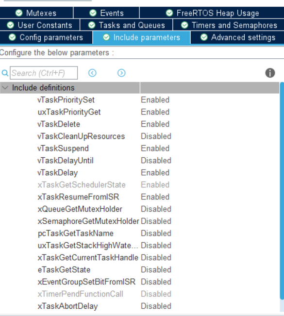
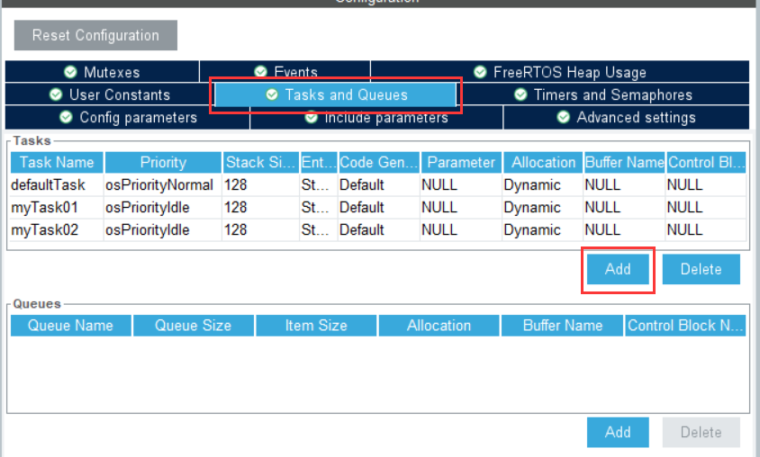
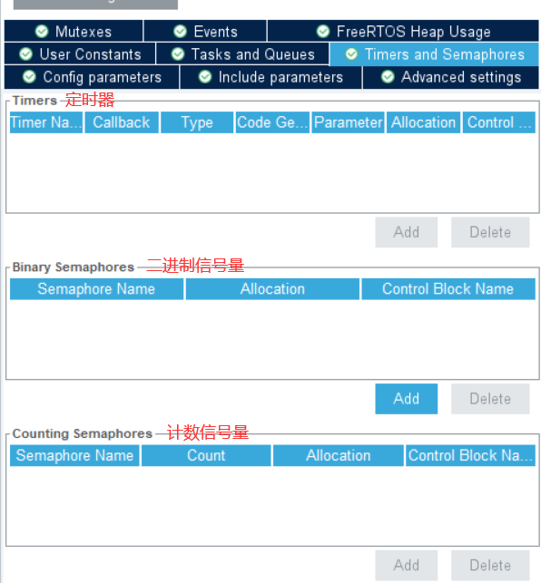
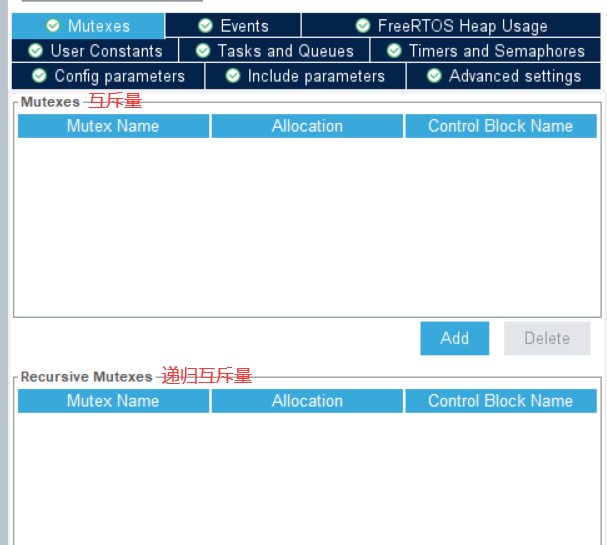
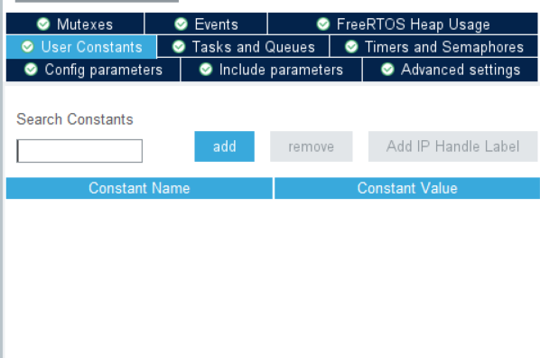
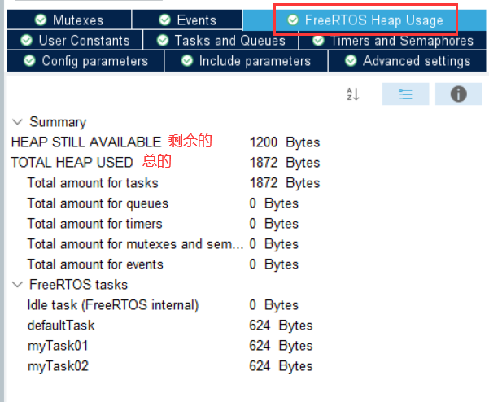
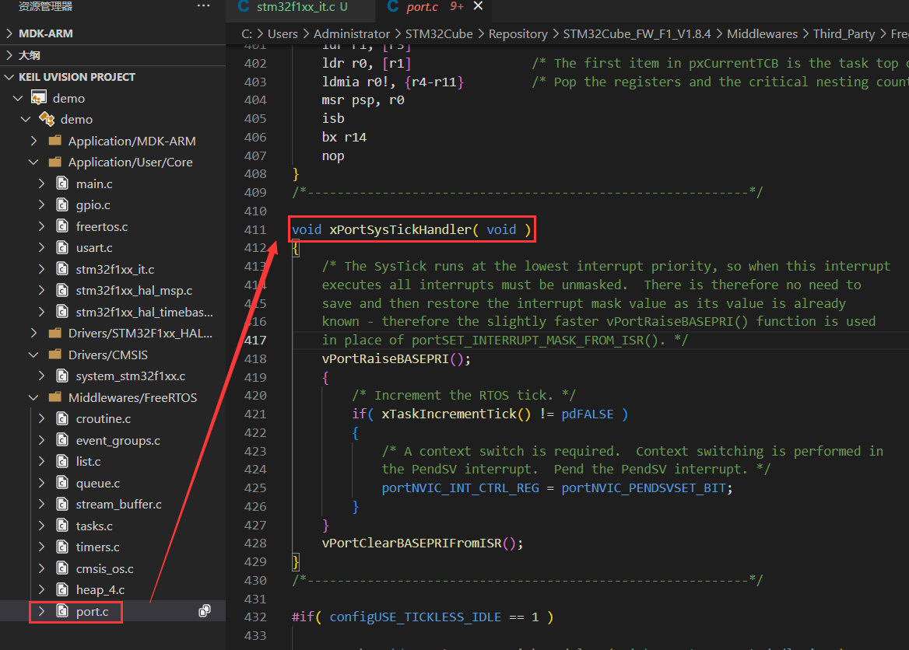
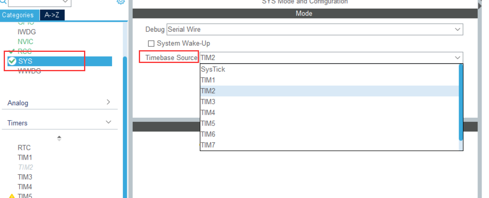
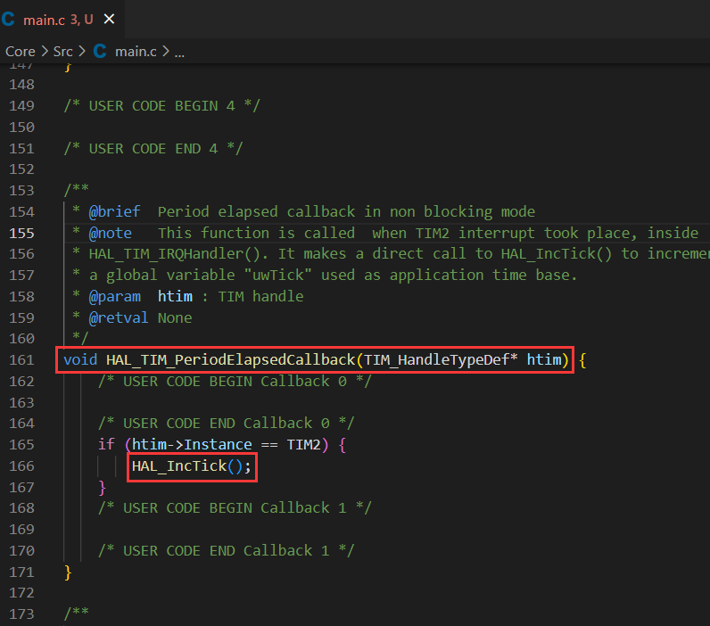
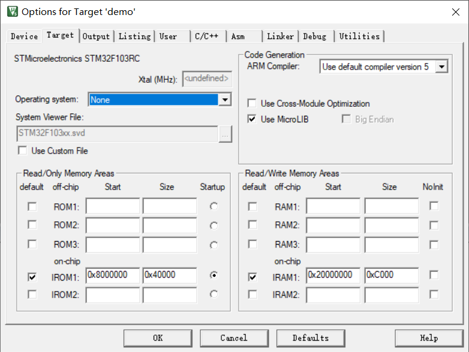

### RTOS

#### 全局配置


此中断优先级是针对硬件芯片的 `NVIC` 中断优先级而言的，与 RTOS 中的任务优先级是不同的。

#### 函数使能



#### 【添加】任务&队列



任务调度的简单理解：在周期性的触发中断里，保存上一个任务的上下文，然后切换到下一个任务中。

#### 【添加】定时器&信号量



#### 【添加】互斥量



#### 【添加】事件标志组


#### 【添加】用户常量

通常不用。



#### 堆使用情况



### 时基

警告：建议使用除了`Systick` 以外的时基。（即 HAL库 和 FreeeRTOS 不要使用相同的时基）


在生成的函数 `SysTick_Handler` 中，可看出 HAL 和 FreeRTOS 使用了相同的时基：




注释的大致意思是：SysTick 以最低的中断优先级运行，因此当该中断执行时，会屏蔽其他所有中断。

```
vPortRaiseBASEPRI()：进入临界区，即将滴答定时器中断设置为最高，防止被其他中断打断。
vPortClearBASEPRIFromISR()：退出临界区，即恢复滴答定时器的中断优先级。
```

**处理方法**：将 HAL库 的时基从 `Systick` 改为 `TIMx` 即可



此处选择 TIM2 作为 HAL库 的是时钟源：



此时的 StsTick_Handler 被定义为 xPortSysTickHandler

```c
#define xPortSysTickHandler SysTick_Handler
```


### 编译器

AC6 较于 AC5 有较大的改动，使用 AC6 直接编译会报错。因此选择 AC5 版本。

